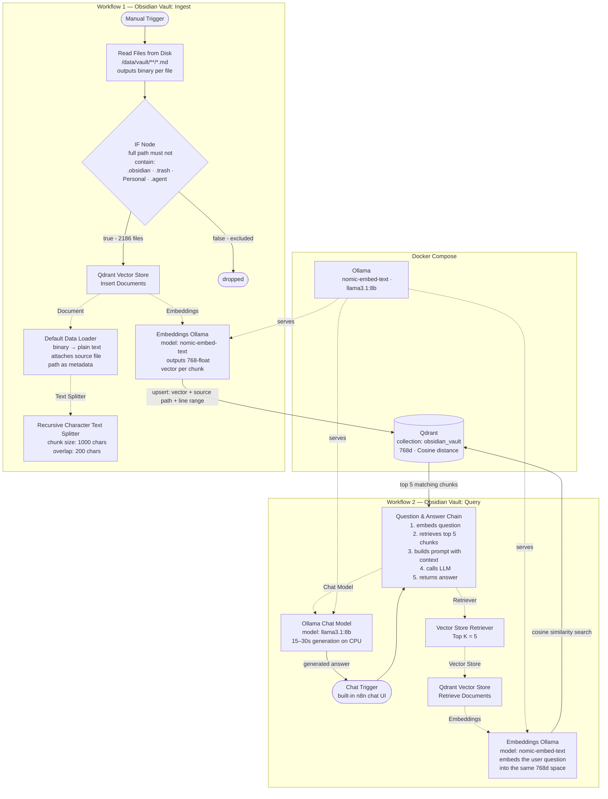

# Obsidian RAG

A self-hosted RAG chatbot that answers questions grounded in an Obsidian vault. No data leaves the machine.

**Stack:** n8n · Qdrant · Ollama · Docker

---

## Architecture



---

## How it works

### Ingestion (`Obsidian Vault — Ingest`)

Runs once (or whenever the vault changes). Reads every `.md` file, chunks it, turns each chunk into a vector, and stores it in Qdrant.

```
Read .md files from /data/vault
    → Filter out excluded folders (.obsidian, .trash, Personal, .agent)
    → For each file:
        Default Data Loader reads raw text
        Recursive Character Text Splitter cuts it into 1000-char chunks (200-char overlap)
        Embeddings Ollama (nomic-embed-text) converts each chunk to a 768-float vector
        Qdrant upserts the vector + metadata (source file path, line range)
```

- **Chunk size 1000 / overlap 200:** overlap prevents a sentence that falls across a boundary from being lost entirely.
- **nomic-embed-text:** 768-dimensional dense embedding model, ~274 MB, fast on CPU.
- **Qdrant collection:** `obsidian_vault`, Cosine distance. Pre-created with explicit dimensions so there's no schema ambiguity if n8n ever tries to auto-create it.
- **Source metadata:** each vector stores the originating file path. This surfaces in query results so the LLM can cite where it got its answer.
- **Not idempotent by default:** n8n generates random UUIDs per chunk per run, so re-running without clearing the collection duplicates vectors. Clear first with `DELETE /collections/obsidian_vault/points` + empty filter before re-ingesting.

---

### Query (`Obsidian Vault — Query`)

Runs on every chat message. Embeds the question, finds the closest chunks in Qdrant, feeds them to the LLM as context.

```
User sends a chat message
    → Question & Answer Chain receives it
    → Embeddings Ollama embeds the question into a 768-float vector
    → Qdrant similarity search returns the top 5 closest chunks (Cosine)
    → Q&A Chain builds a prompt: system message + 5 chunks + user question
    → Ollama Chat Model (llama3.1:8b) generates the answer
    → Response returned to the chat UI
```

- **Why embed the question?** Qdrant compares vectors, not text. The question has to be in the same vector space as the stored chunks — so the same model (`nomic-embed-text`) is used for both ingestion and retrieval.
- **Top K = 5:** retrieves 5 chunks (~5000 chars of context). More chunks = more context but also more noise and slower generation.
- **llama3.1:8b on CPU:** expect 15–30s generation time per response. Slow but acceptable for a local demo.
- **The Q&A Chain is the RAG glue:** it owns the retrieval call, prompt assembly, and LLM call. There's no separate "build prompt" node — it's all internal to the chain.

---

## Services

| Service | Port | Role |
|---|---|---|
| n8n | 5678 | Workflow orchestration, chat UI |
| Qdrant | 6333 | Vector storage and similarity search |
| Ollama | 11434 | Embedding model + LLM inference |
| qdrant-init | — | One-shot: creates the `obsidian_vault` collection on startup |
| ollama-init | — | One-shot: pulls `nomic-embed-text` and `llama3.1:8b` on startup |
| status-check | — | Verifies collection exists and models are installed, then exits |

---

## Running

```bash
docker compose up -d
docker logs status-check   # confirm everything came up clean
```

Open `http://localhost:5678`, run the ingestion workflow once, then start chatting via the query workflow.

---

## Vault setup

- Vault is mounted into n8n at `/data/vault` (read-only)
- Excluded from ingestion: `.obsidian/`, `.trash/`, `Personal/`, `.agent/`
- Embedding model: `nomic-embed-text:latest` (768d)
- Chunk size: 1000 chars, 200 overlap
